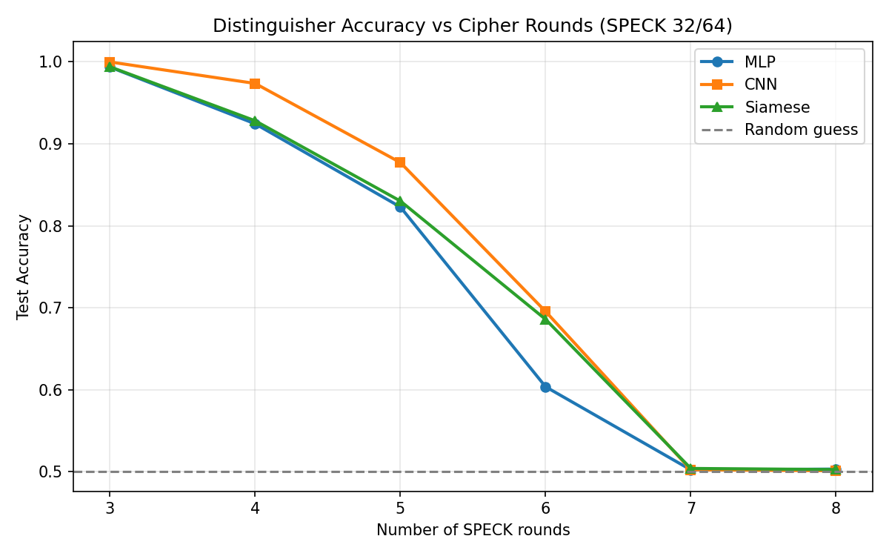

# Neural Cryptanalysis of SPECK 32/64

ML-based distinguishers that learn to tell apart reduced-round SPECK 32/64 ciphertext pairs from random permutations, inspired by [Gohr 2019](https://doi.org/10.1007/978-3-030-26948-7_15).

## Overview

Given a pair of plaintexts with a fixed XOR difference `DP = (0x0040, 0x0000)`, the cipher produces ciphertext pairs `(C, C')` with subtle statistical biases that decay as rounds increase. A random permutation produces no such bias. Neural networks can learn to detect this.

## Results

| Model | R=3 | R=4 | R=5 | R=6 | R=7 | R=8 |
|-------|-----|-----|-----|-----|-----|-----|
| **MLP** | 99.37% | 92.45% | 82.30% | 60.36% | ~50% | ~50% |
| **CNN** | **99.99%** | **97.37%** | **87.72%** | **69.55%** | ~50% | ~50% |
| **Siamese** | 99.40% | 92.82% | 83.03% | 68.59% | ~50% | ~50% |



All models hit random-guess levels at 7 rounds, establishing 6 rounds as the maximum distinguishable boundary for SPECK 32/64 with this input difference.

## Models

| Model | Description | Params |
|-------|-------------|--------|
| **MLP** | 4-layer fully connected network | ~115K |
| **CNN** | 1D residual CNN with 2-channel input (C0, C1) | ~540K |
| **Siamese** | Twin-branch network with shared weights | ~50K |

## Project Structure

```
speck.py          # SPECK 32/64 cipher (vectorized NumPy)
dataset.py        # Data generation (cipher pairs vs random)
models.py         # MLP, CNN, Siamese architectures (PyTorch)
train.py          # Training loop, evaluation, plotting
train_repr.py     # Representation comparison experiment
run.sh            # SLURM job script for HPC cluster
AC_Project.pdf    # Project report
results/          # Plots, ROC curves, training curves
```

## Setup

```bash
pip install -r requirements.txt
```

For GPU support, install PyTorch with CUDA:
```bash
pip install torch --index-url https://download.pytorch.org/whl/cu121
```

## Usage

```bash
python train.py
```

Trains all 3 models on 3-8 round SPECK, then saves plots and results to `results/`.

## Course

This project was developed as part of the **Applied Cryptography** course at IIIT Delhi, taught by **Dr. Ravi Anand**.

## Authors

- Sweta Snigdha (2022527)
- Md Kaif (2022289)
